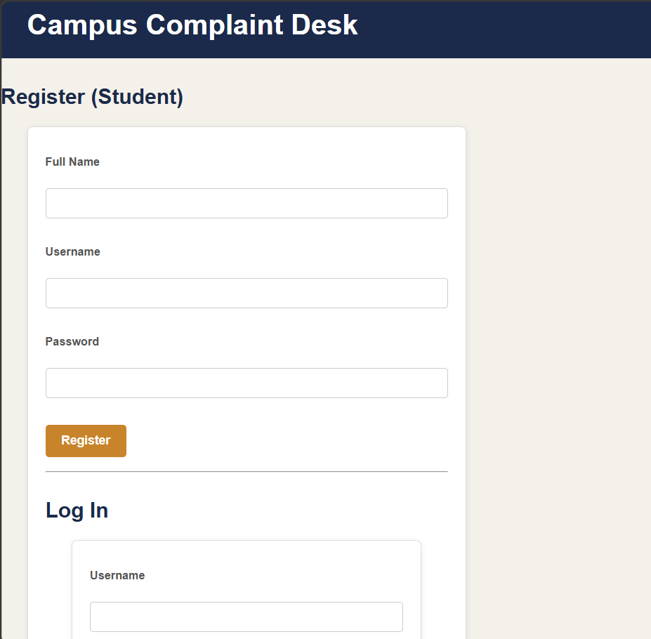
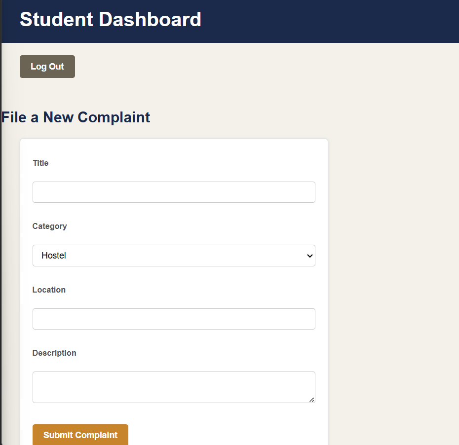
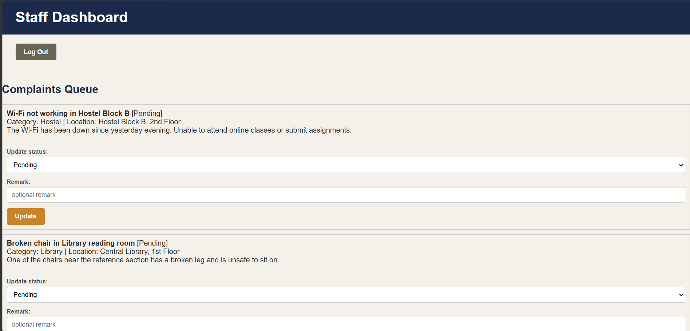
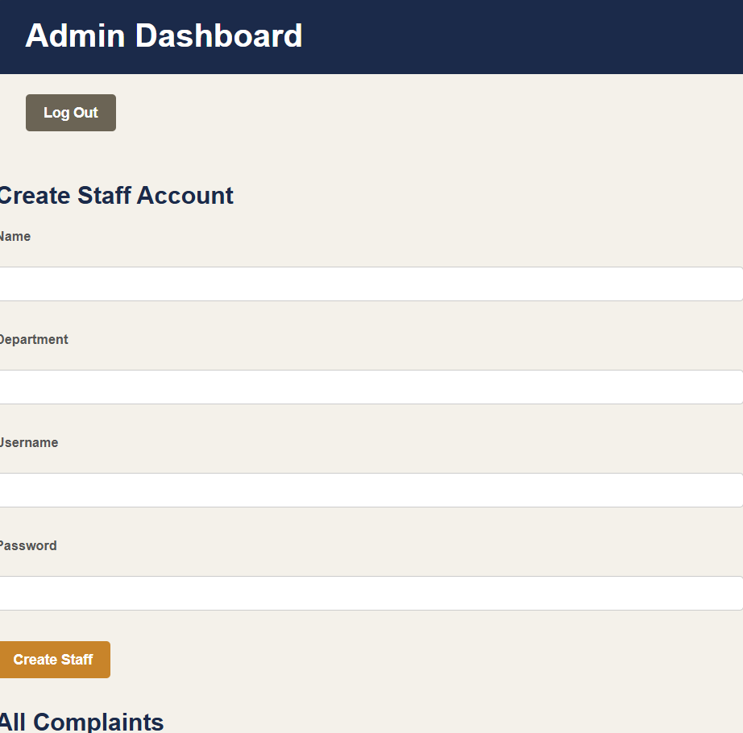

# Campus Complaint Management System

A mini project for managing student complaints on campus — students file
complaints, staff resolve them, and admins oversee the whole process.

## Tech Stack
- **Frontend:** HTML, CSS, JavaScript (no framework)
- **Backend:** Node.js + Express
- **Database:** A JSON file (`backend/data/db.json`) — kept simple for a
  mini project, no separate database server required
- **Auth:** Sessions (`express-session`) + hashed passwords (`bcryptjs`)

## Roles & Features

**Student**
- Register and log in
- File a new complaint (title, category, location, description)
- View status of their own complaints
- See remarks left by staff

**Staff**
- Log in (account created by admin)
- View complaints assigned to them, plus unassigned ones
- Update complaint status and add remarks

**Admin**
- Log in (default seeded account)
- Create staff accounts
- View all complaints
- Assign complaints to staff members

## Project Structure
campus-complaint-system/
│
├── backend/
│   ├── data/
│   │   └── db.json              ← auto-created; stores users & complaints
│   ├── db.js                    ← tiny helper to read/write db.json
│   ├── server.js                ← Express server + all API routes
│   ├── package.json             ← lists backend dependencies
│   └── node_modules/            ← auto-created by npm install
│
└── frontend/
    ├── index.html                ← login + student registration page
    ├── student.html              ← student dashboard
    ├── staff.html                ← staff dashboard
    ├── admin.html                ← admin dashboard
    ├── css/
    │   └── style.css             ← shared styling for all pages
    └── js/
        └── api.js                ← shared helper for talking to the backend

## How to Run

1. Install [Node.js](https://nodejs.org) if you don't have it
2. Install dependencies:
cd backend
npm install
3. Start the server:
npm start
4. Open your browser at **http://localhost:3000**

A default admin account is created automatically the first time you run
the server:
username: admin
password: admin123

## Demo Flow

1. Log in as **admin** (`admin` / `admin123`) → create a staff account
2. Log out → **register** a new student account → log in as that student
3. File a complaint as the student
4. Log in as **admin** → assign the complaint to the staff member
5. Log in as that **staff** account → update the complaint's status and
   add a remark
6. Log back in as the student → see the updated status and staff remark

## Status
✅ Core features complete: registration, login/logout, role-based
dashboards, complaint submission, staff updates, admin assignment, and
styling across all pages.

## Screenshots

**Login / Register**

**Student Dashboard**

**Staff Dashboard**

**Admin Dashboard**

## Author

**Keerthana**
[GitHub](https://github.com/keerthana12-codes)
